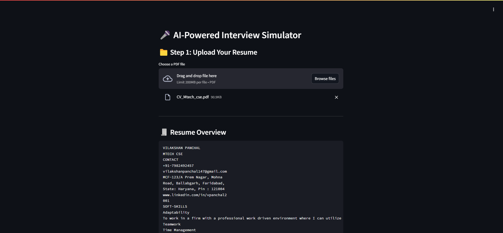
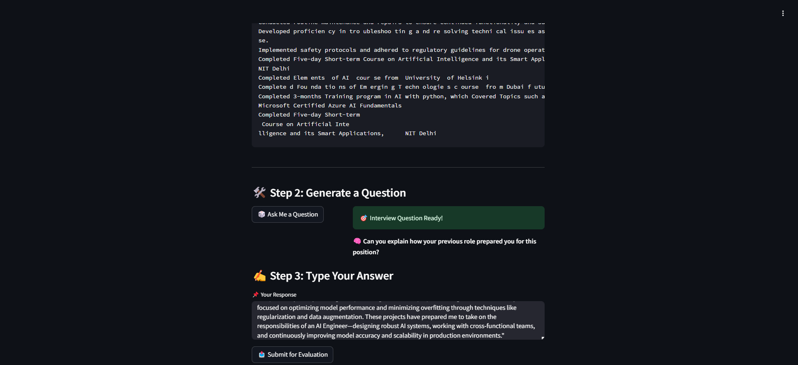
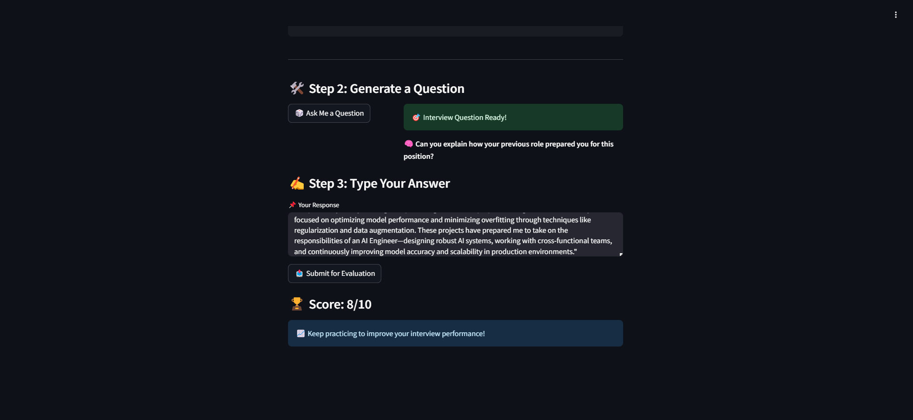

# 🚀 AI-Powered Interview Simulator - POC
*A generative AI-powered interviewer that parses resumes, asks adaptive questions, and scores candidates.*

[](https://www.python.org/)
[](https://opensource.org/licenses/MIT)
[](https://openai.com/)

---

## 🌟 Features  
- **Resume Parsing**: Extract text and tables from PDF resumes.  
- **Adaptive Interviewing**: Context-aware questions using RAG and GPT-3.5-turbo.  
- **AI Scoring**: LLM-as-a-judge evaluates responses on a scale of 1–10.  
- **Streamlit UI**: User-friendly interface for mock interviews.

## ⬇️ Install dependencies:
``` bash
    pip install -r requirements.txt
```

---
## 📸 Screenshots  

### Resume Upload & Parsing  
  
*Figure 1: Upload a PDF resume to start the interview.*  

### Adaptive Question Generation  
  
*Figure 2: AI generates context-aware questions based on resume content.*  

### Answer Submission & Scoring  
  
*Figure 3: Candidate receives a score after submitting their response.*  

---
## 🛠️ Tech Stack  
- **Backend**: Python, LangChain, OpenAI API  
- **PDF Parsing**: PyMuPDF, Camelot  
- **UI**: Streamlit  
- **Vector Database**: FAISS  

---

## 🚀 Quick Start  

### Prerequisites  
- Python 3.9+  
- OpenAI API Key ([Get one here](https://platform.openai.com/))  

### Installation  
1. Clone the repository:  
   ```bash
   git clone https://github.com/Vilakshan123/AI-Powered-Interview-Simulator.git
   cd AI-Powered-Interview-Simulator
